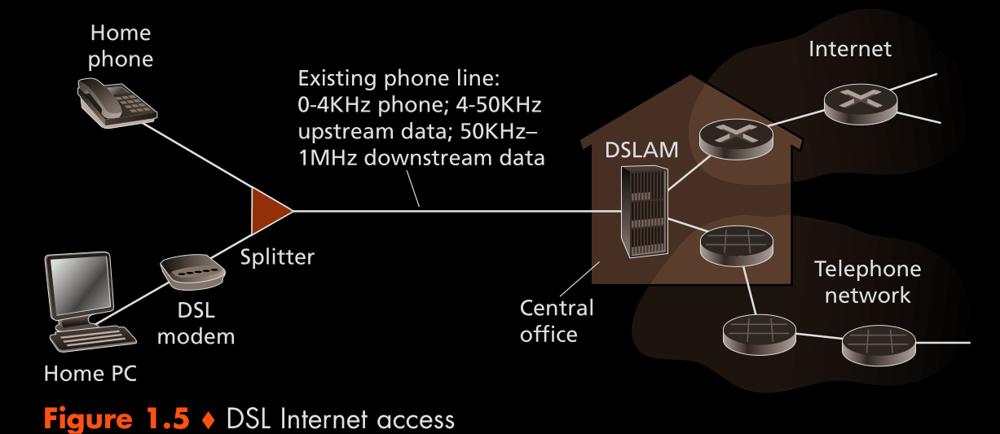
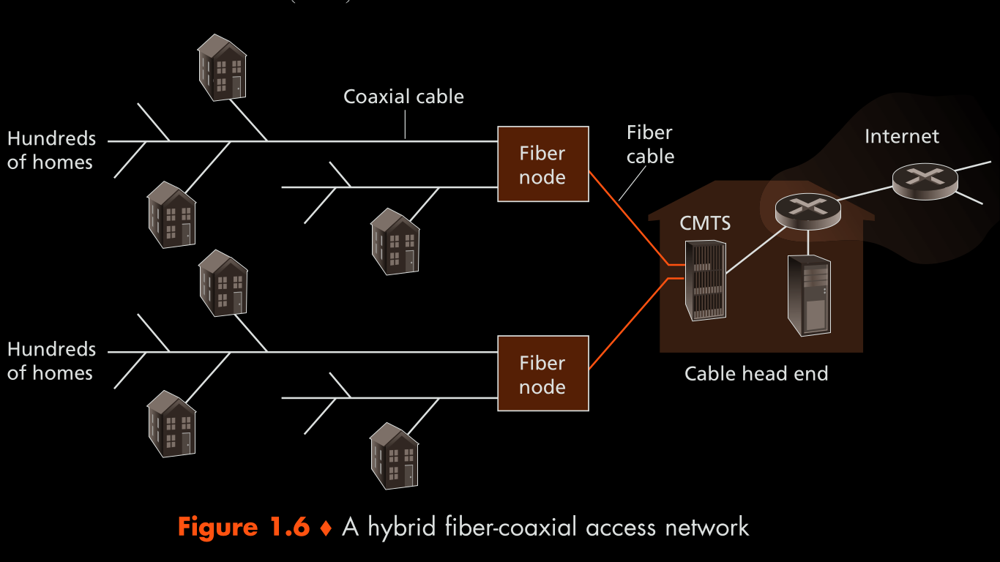
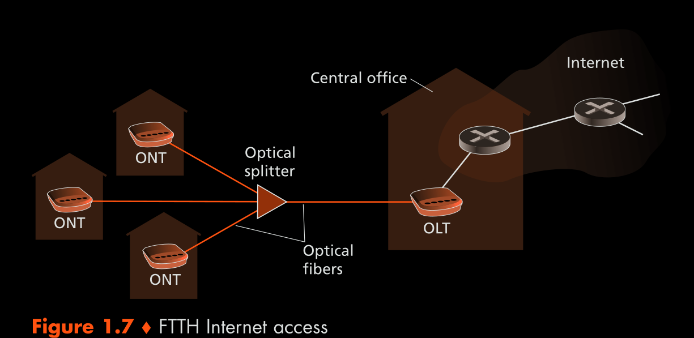

### 1. Network Edge
- End systems aka hosts that connect to the internet via access networks
- End systems run application programs (example: email server/client)
- General types of end systems: Client and server
#### 1.1 Evaluating the performance of a network link
- Bandwidth:
	- Bandwidth = frequency upper bound - frequency lower bound
	- Proportional to capacity of the link (Shannon Link capacity)
- Transmission rate:
	- How much data can be sent over the link per unit time
	- This is the time the NIC takes to encode the data and send it over the link
- Link capacity:
	-  Shannon Link capacity = bandwidth \* log2(1 + Signal to noise ratio)
	- #TODO: Learn what this formula does
#### 1.2 What are access networks? 
- Connects the end systems to the nearest gateway router
	- Gateway router connects to other ISPs
- Types of access networks
	- DSL - digital subscriber line
		- The telephone link is shared for voice calls and internet. This is a dedicated link from telephone company office to the end user's home
		- The telephone link is a copper twisted pair line
		- The link is shared using frequency division multiplexing. The telephone company has a DSL access multiplier (DSLAM) that connects to multiple cables
		- Voice only requires less bandwidth (B1 is the least)
		- More bandwidth is allocated to down link (B2 is the highest)
		- Less bandwidth is allocated to up link 
		- Allocating the bandwidth is done based on the needs. In this case, the end systems are more down link heavy, therefore more bandwidth is allocated for down link 
	- Cable internet access
		- Uses coaxial cables to connect homes to fiber optic nodes, and fiber optic cables to connect telecom company and fiber optic nodes 
		- Uses frequency division multiplexing
		- Some bandwidth is allocated to transmitting tv channels, rest is allocated for data(bandwidth allocation is asymmetric similar to DSL)
		- The cable company has a cable modem termination system(CMTS) that converts the analog signals from the fiber cables to digital signals 
		- Each coaxial cable is shared by multiple users, the upstream and downstream channel is also shared by all the users sharing the cable  
	- Fiber to the home(FFTH)
		- Uses fiber optic cables 
		- Simplest technology of FFTH: One fiber cable from the internet provider which is split into multiple cables using an optical splitter 
		- There are two optical-distribution network architecture
		- AON:
			- Active optical networks
			- Has a electrically powered switch
			- Similar to switched ethernet #TODO (read about switched ethernet)
		- PON:
			- Passive Optical Networks
			- Uses a passive optical splitter (does not need any electricity)
			- Each home has a Optical Network Terminator(ONT)
			- The Central office has an Optical Line Terminator(OLT) 
		- Figure below shows PON: 
	- Satellite network
		- Used when DSL, Cable or FFTH is not available
		- Uses radio waves as physical media
		- Two types
			- Geo stationery satellites: It is located further away from earth, hence has high propagation delay. Few satellites are sufficient for coverage
			- Low earth orbit satellites: closer to earth, lower propagation delay. Many satellites are required for coverage
	- Dial up
		- Similar to DSL, uses telephone line for internet access
		- Unlike DSL, both internet and voice call cannot be used simultaneously in dial up
	- Ethernet, WiFi
		- Ethernet switch connects to different end systems
		- Switch is also connected to a router
	- Wide area wireless networks: 3G and LTE
		- Uses Ultra high frequency waves in the radio waves
		- Wave length is proportional to the penetration depth 
		- Higher the bandwidth, higher link capacity. 
#### 1.3 Physical media
- Twisted copper wire
	- Guided physical media
	- Cheapest to buy
	- Types: unshielded twisted pair and shielded twisted pair
	- The wire is twisted to reduce electrical interference
- Coaxial cables 
	- Guided physical media
	- Two concentric copper wires
- Optical Fiber
	- Guided
	- Low signal attenuation
	- Expensive
- Radio Channels
	- Unguided
	- Slower compared to guided physical media but can be used to cover large distances
	- [Radio spectrum](https://en.wikipedia.org/wiki/Radio_spectrum)

### 2. Sharing a Physical link
- Each physical link can be shared by multiple end systems
- The following are the strategies to share the link
#### 2.1 Synchronous Time Division Multiplexing
- Divide time into equal quanta, allot each time quanta to a host
- The time slots are preassigned and fixed for each source
- The host can send data only when it's assigned slot arrives
- Even if the other hosts are idle, the host that wants to send data needs to wait for it's assigned time slot
#### 2.2 Frequency Division multiplexing
- Divide frequency into different slots, each slot is assigned to a host to transmit data
- If one host is assigned a frequency band, even if the host is inactive, other hosts cannot use this frequency band
#### 2.3 Statistical Time Division Multiplexing
- Physical link is shared over time
- Rather than fixed time slots, the number of time slots are dynamic
- Let's say there are no hosts sending data, i.e. the physical link is idle
	- If host 1 wants to send data, it can send the data immediately
	- If host 2 wants to send data, it waits for host 1 to complete sending data
	- To prevent host 1 from hogging the link, the max size that host 1 can send is fixed
- To decide which host packet to forward at a switch, there are scheduling algorithms specific to the switch