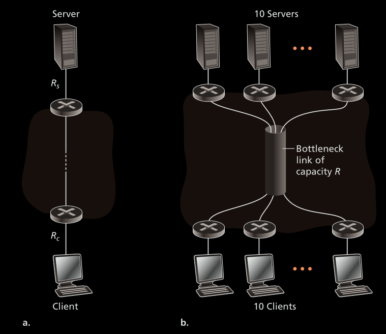

### 1. Delay, loss and throughput for packet switched network
#### 1.1 Delay
- The total delay in sending a packet over the network will be the sum of the following delays
	- Processing delay
		- Time required to add headers, query the routing table and examples of processing delay
	- Queuing delay
		- Due to sudden increase in rate of incoming packets, the queue can get full. This will lead to all future packets being dropped until the queue has space for another packet 
		- Let the size of a Packet be L, the average rate at which packet arrives be a, and the transmission rate be R
		- L\*a/R will give the load for the router
			- When La/R = 0, avg queuing delay = 0
			- When La/R = 1, avg queuing delay is large
	- Transmission delay
		- Time taken by the NIC to encode a bit into a signal
	- Propagation delay
		- Time required to cover the distance between the source and destination, through the physical media 
		- During propagation, the packet can get corrupted. This will cause the host to dorp the packet 

### 2. Throughput
- Instantaneous throughput: 
	- Rate at which the receiver is receiving the file
	- Example: when downloading a file in the browser, the browser shows the instantaneous throughput
	- Instantaneous throughput is calculated in delay critical applications such as video streaming. In video streaming, the instantaneous throughput should be above a threshold.
- Average throughput
	- Avg throughput = File Size/Time to receive entire file
	- Example: In file transfer, the average throughput must be high
- Calculate the throughput for the following case 
	- Assume that there is no other traffic other than the traffic between client and server. If there is other traffic, the link with the highest congestion will become the bottleneck link, even if the bottle neck link has the highest link rate compared to all other links
	- For case A: 
		- The max throughput will be the min(R1, R2, ... R2)
	- For case B: 
		- Max throughput will be min(Rc, Rs, R/10)
		- Here Rc is the link rate between the client and common link Rs is the link rate of link between the server and the common link. 
		- The rate of the common link is R, assuming that all hosts share the link equally, Each host can send at the rate of R/10
- Which packet forwarding is faster if the links have unequal transmission rates?
	- Client ----(Rc bps)----Router----(Rs bps)----Server
	- The size of the packet is L bits, the propagation delay can be ignored and Rc < Rs
	- Case A: Cut-through switching
		- Avg Throughput = L/Time to receive L bits = Rc/2 
		- Time to Receive L bits = dprop + dtrans-client + dtrans-router = 2L/Rc
			- Assuming dprop is small, ignore dprop
			- dtrans-client = 1/Rc
			- dtrans-router = 1/Rc, this is because, the router needs to wait for the bit to reach the router
	- Case B: Store and forward switching
		- Avg Throughput = L/Time to receive L bits 
			- = Rc\*Rs/(Rc\+Rs)
		- Time to Receive L bits = dprop + dtrans-client + dtrans-router = L/(Rc\*Rs/(Rc\+Rs))
			- Assuming dprop is small, ignore dprop
			- dtrans-client = L/Rc
			- dtrans-router = L/Rs
	