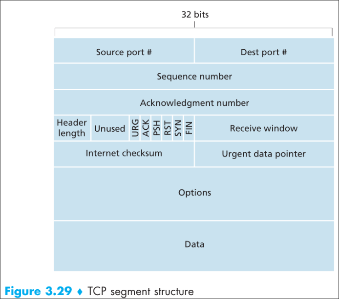
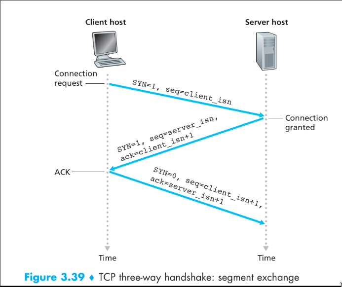
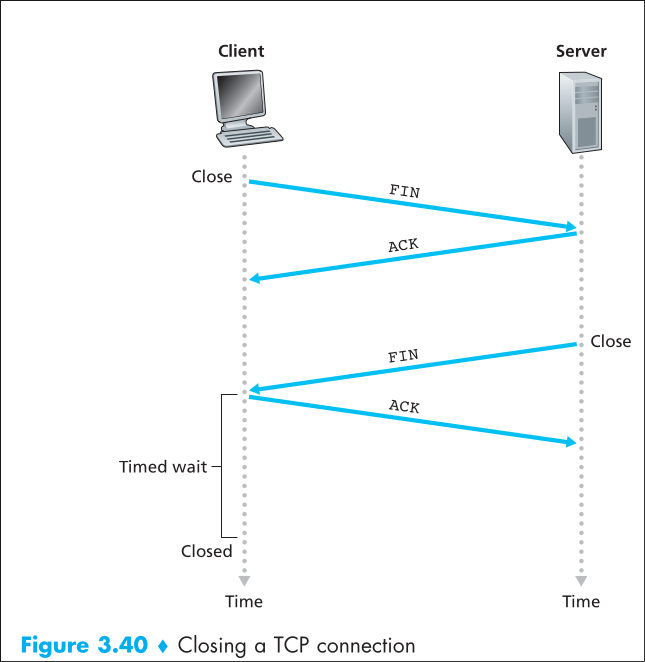

#### 1 TCP - Transmission control protocol
- Defined in [RFC 9293](https://datatracker.ietf.org/doc/html/rfc9293)
- Features
	- Full duplex
	- Connection oriented
	- Reliable data transfer
	- Point to point
		- Connection can exist only between two Processes
		- No multicasting 
	- Byte oriented
		- Sequence number is assigned to each byte rather than packet
- Uses the methods described in [[3.2 Transport Layer - Reliable data transfer]]

#### 2 TCP Connection Overview
- **What is it?**
	- Handshake is required between two process
		- Without this two process cannot communicate
			- Client: host that initiates the connection
			- Server: host that accepts the connection
	- Handshake is used to 
		- Initialize TCP state vars
		- Allocate buffers  
	- Once Handshake is completed, a logical connection is established
		- **What is logical connection?**
			- This connection is not similar to the one in circuit switched network 
			- This connection is transparent to the network core
- **Connection Characteristics**
	- Point to point
		- A TCP connection is only between two processes
		- There cannot be more than two processes involved in a TCP connection
	- Full duplex
		- Two process in TCP connection can exchange data at the same time
- **How is a connection established?**
	- Using a three way handshake [[3.3 Transport Layer - TCP#8 Three way handshake]]

##### 3 Sending data overview
- Both processes have two buffers
	- Send buffer
	- Receive buffer
- The client sends data through the socket
	- The data is stored in the send buffer
	- TCP grabs chunks(each chunk of MSS size) of data form the send buffer
		- MSS - Maximum Segment size
			- The max size of the **application data in a segment**
		- MTU - Maximum transmission unit
			- The maximum size of the network layer frame
			- This is determined first
				- Using the MTU the MSS is determined
			- The max size of application data, TCP headers and IP Headers
		- TCP can use path MTU discovery to determine the path's smallest MTU
		- The MTU discovery is required to avoid IP fragmentation at source and in the network core
		- **Why is IP fragmentation bad?**
			- Excessive re-transmission of packets
			- Since IP fragmentation is transparent to TCP, when a fragment is lost, TCP needs to send the entire segment again
	- TCP creates a segment
		- Add source port and destination port
		- Add error checking bits
		- Add TCP Headers
	- TCP sends the segment to subsequent layer
- The receiver application gets the data form the receive buffer
	- The TCP check for errors and constructs the data 
	- Once data is received the TCP sends the data to the destination socket address present in the headers and to the receive buffer for the application
	- Server process fetches the data form receive buffer and does it's processing
- TCP uses a combination of GBN and SR
	- TCP uses cumulative ack
	- When a segment is delivered out of order, TCP sends the ack for the latest packet that was received in order(similar to GBN)
	- If the ack with ack num x reaches the sender
		- all bytes less than seq num x has been received without error by the receiver 

#### 4 TCP Segment Structure

- **Source/Destination port**
	- Size: 16 bits each
- **Sequence Number**
	- Size: 32 bits
	- Contains the Sequence number for segment
	- **How is seq num generated?**
		- Seq num is for each byte of application data and not for a TCP segment
		- If data is 1000 bytes and MSS is 500
			- Total number of segments is 4
			- The first segment num is x
				- x is a randomly chosen initial seq num (ISN)
			- The second segment num is x+500
				- As the first segment has 500 bytes of data, the second segment will have the data from byte 500 (0 indexing)
			- The third segment num is x+1000 and so on
- **Ack number**
	- Size 32 bits
	- Contains the next sequence number the receiver is expecting
	- If the receiver received a segment with seq num x
		- ACK num will be the next segment the receiver is expecting
			- The segment with seqNum x will have the bytes from [x, x + MSS - 1] 
			- The next segments sequence number will be 1 + x + MSS - 1, which is the first byte of next segment
			- ACK for receiving packet with seqNum x will be x+MSS
		- **How is the ACK field determined if the application data is zero**
			- This case happens in the handshake
			- The handshake segments will not have the data
			- For this case, the ack will be 1 + seqNum of the handshake packet
	- TCP also has the option of selective acknowledgment(SAck) using the 
- **Header length:**
	- Size: 4 bits
	- Specifies TCP header length in 32 bit words
	- if header length is 0011
		- TCP header size will be three 32 bit words -> 96 bits
- **Options field**
	- Optional and has variable length 
	- Used when negotiating the MSS
	- Contains the fields like time stamp for high speed networks
- **Flag field:** 
	- 6 flags each 1 bit
	- Flags
		- ACK: Indicate the ACK num in header is valid
		- RST: 
			- Reset flag
			- When client sends SYN packet but the server does not accept connection on the port, the server sends a special segment with RST bit set to 1
		- SYN: Connection setup
		- FIN: Connection teardown
		- PSH: Informs TCP to send data to upper layer immediately
		- URG: TCP informs urgent data present, TCP sends URG pointer field to upper layer
- **Urg pointer**
	- 16 bit 
	- Indicates the last byte of urgent data
- **Check sum:** error checking, includes both header and data for checksum
- Receive window
	- 16 bit 
		- Max receiver window size is 2^16 Bytes or 64 KB
	- Used for flow control
	- Indicates the number of bytes receiver is willing to accept
	- [TCP window scaling](https://en.wikipedia.org/wiki/TCP_window_scale_option)
#### 5 TCP Connection 
- **Connection establishment**
	- Connection is established through a three way handshake
		- 1st message is TCP SYN, with 0 bytes of data
		- 2nd message is a reply to TCP SYN, with SYN and ACK flags set to 1
		- 3rd message ACK(Use this packet to piggy back data) 
- **Sending data**
	- TCP grabs chunk of data (max size of this chunk is MSS) and encapsulates it with TCP headers 
	- Send the TCP segment to IP layer 

- **Connection tear down**
	- Client or server sends a packet with FIN flag set
	- The recipient sends an ack
	- The recipient sends a packet with FIN flag set
	- The sender will send an ack
	- The sender will wait for a certain time before the connection is closed(this time is used to handle the lost ack, and resend the FIN segment if necessary)

#### 6 Timeout & Round Trip Time estimation
- Sample RTT
	- Time taken form sending segment to Network layer to receiving an ack for the segment
- Estimated RTT = (1-alpha)Estimated RTT + alpha\*sample RTT 
	- alpha = 0.125
- Deviation from Est RTT
	- dev RTT = (1-beta)dev RTT + beta\*|sample RTT - Est RTT|
	- beta = 0.25
- Time out = Est RTT + 4\*dev RTT
	- TCP uses a single timer instead of timer for each packet
	- One timer is used because managing multiple timers can cause overhead
	- Once a timeout occurs, the time out is doubled
		- The timeout is calculated again when the ack is received
- The recommended initial timeout value is 1 second [RFC 6298](https://datatracker.ietf.org/doc/html/rfc6298#appendix-A)

#### 7 Duplicate ACK and fast retransmit
- If the receiver receives a segment out of order
	- The receiver sends an ack for the next in order seq num 
	- Even if this ack is already sent, the sender interprets it for fast retransmission
- When sender receives **three duplicate** ack for the latest ack segment
	- The sender understands that some segment reached the receiver out of order
	- The sender sends the segments immediately before the time out occurs
		- This makes sure the receiver does not have wait for time out to occur in the sender to get the segment
	- **NOTE:** The sender sends only the one packet that the receiver is expecting
		- If the three duplicate ack had a seqNum of x
		- The sender will retransmit only the segment with seqNum x 

#### 8 Flow control
- Mechanism used to prevent the overflow of receive buffer
- The receive window in the header field is used to denote the free space in the receive buffer
- When receive window is 0, the sender sends one byte of data until the receive window has non zero value in the ack for the byte the sender sent