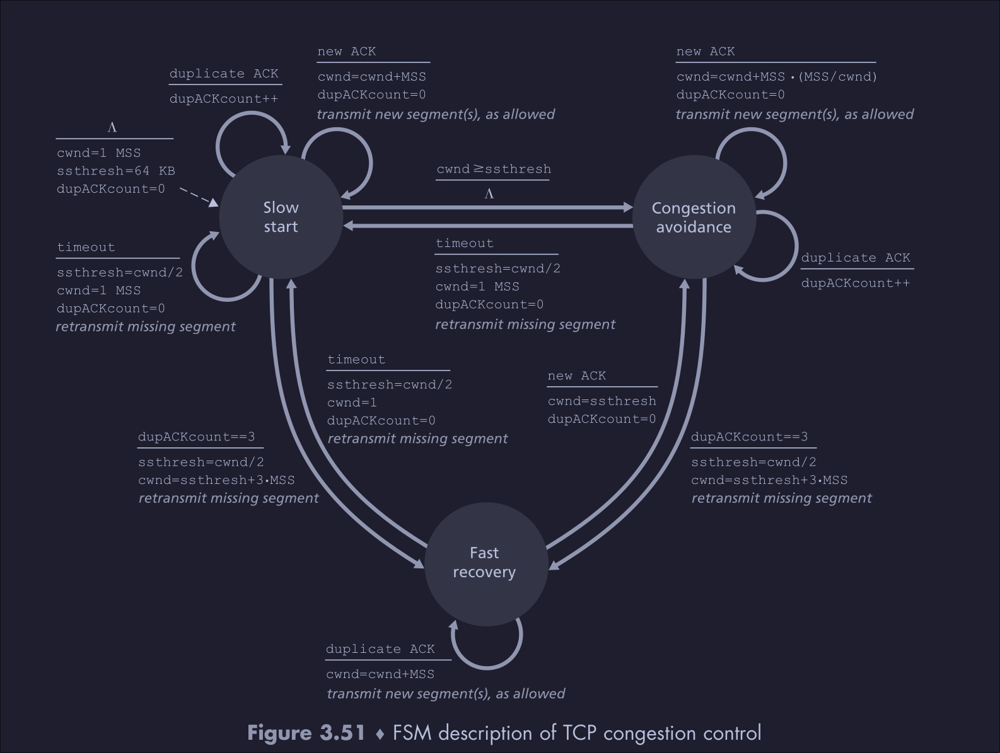
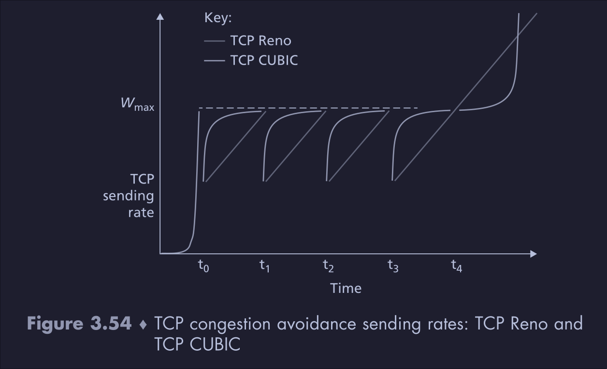

### 1 What is Congestion control?
- Congestion control throttles the sender which limits the number of packets sent over the network
- **How is this different from flow control?**
	- Flow control makes sure that the sender does not overflow the receiver's receive buffer
	- Congestion control limits the rate at which packets are sent by the sender based on network congestion
- **What does network congestion mean?**
	- The network core devices cannot handle more packets due to buffers overflow
- **Approaches to congestion control**
	- End to end congestion control
		- The TCP layer determines the congestion based on packet delay and packet loss
		- When there is a packet loss, TCP assumes there is a network congestion and
			- Reduces the sender window size or
			- Doubles the RTT when a packet loss occurs
	- Network assisted congestion control
		- The intermediate network core devices provide feedback about the network congestion
		- Used in networks such as ATM

### 2. What happens in TCP Congestion control
- **TCP uses end to end congestion control approach**
	- This is because the IP protocol, Internet's network layer protocol, does not give any feedback about the network congestion to the end
		- **Improvements**: Currently TCP with explicit congestion notification uses the IP TOS field for network assisted congestion control
	- IP does not send congestion messages explicitly to end hosts because this will reduce the bandwidth usable to transfer host packets
		- **Improvements**: IP has a separate TOS field that has two bits for congestion notification [RFC3168](https://datatracker.ietf.org/doc/html/rfc3168#section-5)
		- If both end devices support explicit congestion notification, the network core devices can set the bits in TOS to inform the end devices that the network is congested
		- TCP will use the IP TOS field to set the TCP Explicit congestion notification Echo(ECE)
		- When a TCP client receives a TCP packet with ECE bit set, it will set the TCP Congestion window reduced bit(CWR) for the ack and reduce the cwnd size
	- Having network core devices send congestion messages makes them more complex
- **How to limit the send packet rate?**
	- Receiver maintains a variable: congestion window size
	- The number of unacked packets in the network(Sender window size) < min(congestion window size, receiver window size)
		- Here the receiver window size is the bytes that the receiver can accept based on the free space in the receive buffer
- **Phases of congestion control**
	 - **Slow start**
		- Modifies the congestion window size at the start of the TCP connection
		- Start at congestion window size  = 1 MSS
		- Increase cwnd by 1 MSS for every new ack 
			- For each new ack, send two new packets
			- This will double the cwnd at the end of 1 RTT
		- When there is a timeout
			- Set ssthresh = (cwnd)/2 
			- Set sender window size to 1
			- Start slow start process again
		- When sender window size is equal to ssthresh, use AIMD
	- **AIMD** (additive increase multiplicative decrease)
		- Modifies the congestion window size for an on going TCP connection
		- Increase the congestion window size by **1 MSS for 1 RTT**
			- **Note**: In **slow start**, the congestion window doubled for every RTT
			- In **AIMD**, the cwnd will increase by 1 MSS in every RTT
			- This is equivalent to increasing the cwndnew by MSS/cwndold for every new ack
				- Let the current cwnd size be 8 MSS, for each new ack, increase the cwnd by 1/8 MSS
		- When three duplicate ack is received
			- Set ssthresh = (sender window size)/2
			- Set sender window size to ssthresh
		- If timeout occurs, the congestion window size is set to 1
- **Note**: TCP is a **byte oriented protocol**, it increases the cwnd size in bytes and **not in units of MSS**. For simplicity, MSS is used in explanation of congestion control

### 3. TCP Congestion algorithms variants 
#### 3.1 TCP Reno
#### 3.2 TCP New Reno
- In Reno, when receiving dup ack, new Reno will send a new packet till there is a timeout or new ack received
- New Reno, when receiving dup ack, send the required packet immediately
#### 3.3 TCP Tahoe
- Does not have fast recovery state
- For dup acks and timeout, set the cwnd to 1
#### 3.4 TCP Cubic [RFC9438](https://datatracker.ietf.org/doc/html/rfc9438#name-principle-1-for-the-cubic-i)
- Variant of TCP Reno, 
- Replace AIMD in congestion avoidance, with a cubic increase in congestion window
- Increase at higher rate when far from slow start threshold
- Near Slow start threshold increase slowly
- Graph showing TCP Cubic congestion avoidance 
- **Maintain new state vars**: w_max, k and t_cur, t_epoch
	- **w_max** is cwnd size where packet loss occurred
	- **k** is the time that took to reach w_max from the start of congestion avoidance phase
	- **t_cur**: current sys time
	- **t_epoch**: time at which congestion avoidance phase started
	- t = t_cur - t_epoch
- **Congestion window update** $cwnd_{new} = C*(t - K)^3 + cwnd_{max}$
- **Congestion window decrease**
	- When timeout occurs **TCP cubic** reduces the cwnd by a factor of 0.7
	- TCP Reno decrease the cwnd by a factor of 0.5
#### 3.5 TCP Vegas 
- **Delay based** approach to modify the TCP congestion window
	- Instead of using ack to determine the network congestion, use the end-to-end delay to control the congestion window
- **Motivation**
	- In ack based congestion control algorithms, the number of packets sent in the network keeps increasing till timeout
	- When timeout occurs, the cwnd is halved, which is much lower than where the timeout occurred(i.e. the capacity of the network)
	- In delay based approach, reduced the congestion window even before the loss occurs
- Maintain the following **state var**
	- RTTmin: The minimum RTT observed
- **Modifying the congestion window**
	- RTTmin occurs when there is minimum queuing delay
	- The max throughput = cwnd/RTTmin
	- If the current cwnd is close to max throughput, then the current congestion window can be increased
#### 3.6 TCP With explicit congestion notification
- Network assisted congestion control variant of TCP 
- TCP has two bits for congestion notification and congestion window reduced
- IP has a TOS header which contains bits to set during congestion
- Router will set the IP congestion bit if it is congested, any router along the path with not modify this bit 
- When the receiving end host detects the IP congestion notification, set the TCP congestion notification bit
- When the receiver receives the TCP congestion notification bit, set the TCP reduced congestion window bit and reduce the cwnd size

### 4. TCP Reno throughput and fairness 
#### 4.1 TCP Reno throughput
- Consider only the **congestion avoidance phase** of TCP Reno, the host has a dedicated link of R bps 
- At the start of congestion avoidance phase, the cwnd will be of size R/2, 
- The cwnd will increase till R and then fall back to R/2 when packet loss occurs
- The cwnd size will vary as shown in the graph below
- The effective throughput will be $(0.5*R +R)/2 = 0.75R$

#### 4.2 TCP congestion avoidance fairness
- Consider TCP Reno congestion avoidance phase  
- If there are N hosts sharing a bottleneck link with R bps link rate(assume only TCP traffic is present)
	- Each host should use R/N bps
	- The TCP congestion avoidance algorithms ensure this property