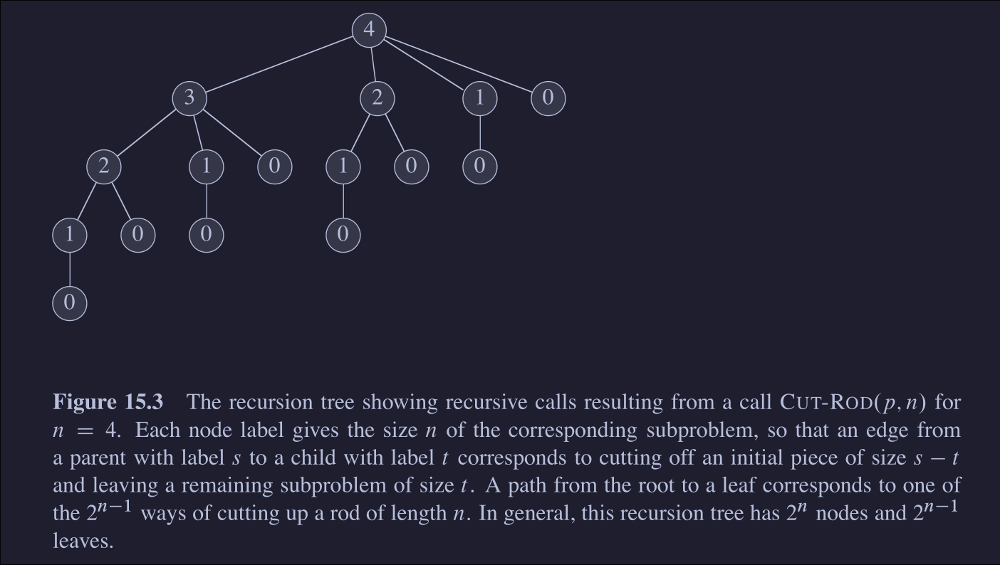

### 1. Generic approach
- Divide problem into subproblems
	- The problem should have optimal substructure property
- Find the optimal value for subproblems in bottom up fashion

#### 1.1 Rod cutting 
##### Goal
- Given 
	- A rod of length N
	- Table with length of a piece and corresponding price
- Find the maximum revenue by cutting the rod and selling the pieces 
##### Approach
- **Naive approach**
	- Find all the possible cuts and get maximum
	- Complexity
		- $O(2^n)$, where n is the length of the rod
		- For a rod of length n, a total of n-1 cuts can be made
		- For each unit length, the rod can be cut or not cut
		- Total possibilities $2^{n-1}$, n-1 possible places to cut, for each place, 2 possibilities(make cut, no cut)
	- Recursion tree for Naive approach: 
		- There are multiple subproblems that overlap, these results can be stored
	- Program
```c
int cut_rod(int rod_length, int* rod_price) {
	if (rod_length == 0) {
		return 0;
	}
	int price = rod_price[rod_length];
	for (int cut_len = 0, cut_len < rod_length; cut_len++) {
		price = max(
				price, 
				rod_price[cut_len] + 
				cut_rod(rod_length - cut_len, rod_price);
	}
	return price;
}
```

- **Top down approach, with memoization**
	- Approach
		- Divide the rod and find the revenue after dividing rod, store this revenue in an array
		- Here $i^{th}$ index in revenue gives the maximum revenue obtained from rod of length i
	- Program
```c
int cut_rod_helper(int rod_length, int *rod_prices, int *revenue) {
	if (rod_length == 0) {
		return 0;
	}
	if (revenue[rod_length] != INT_MIN) {
		return revenue[rod_length];
	}
	int cur_revenue = revenue[rod_length];
	for (int cut_len = 1; cut_len <= rod_length; cut_len++) {
		cur_revenue = max(cur_revenue, rod_prices[cut_len] +
		   cut_rod_helper(rod_length - cut_len, rod_prices, revenue));
	}
	revenue[rod_length] = cur_revenue;
	return revenue[rod_length];
}

int cut_rod(int rod_length, int *rod_prices) {
	int *revenue = (int *)(malloc((rod_length + 1) * sizeof(int)));
	revenue[0] = 0;
	for (int ind = 1; ind <= rod_length; ind++) {
		revenue[ind] = INT_MIN;
	}
	cut_rod_helper(rod_length, rod_prices, revenue);
	return revenue[rod_length];
}
```

- **Bottom up approach**:
	- Approach
		- Compute the revenue for smaller rod length, to compute the bigger rod length revenue, use the already computed smaller rod length values
	- Program 
```c
int cut_rod_v2(int rod_length, int* rod_prices) {
	int* revenue = (int*)(calloc(rod_length + 1, sizeof(int)));
	for (int cur_rod_length = 1; cur_rod_length <= rod_length; cur_rod_length++) {
		int cur_price = INT_MIN;
		for (int cut_length = 1; cut_length <= cur_rod_length; cut_length++) {
		  cur_price = max(cur_price, rod_prices[cut_length] + revenue[cur_rod_length - cut_length]);
		}
		revenue[cur_rod_length] = cur_price;
	}
	return revenue[rod_length];
}
```


#### 1.2 Matrix chain multiplication
##### Goal
- Given n matrices, find the order in which the matrices must be multiplied to minimize the number of scalar multiplications
- For multiplying two matrices of size (p, q) and (q, r)
	- The number of scalar multiplications = p * q * r
- Dimension of $i^{th}$ matrix is $(p_{i-1}, p_i)$, where i is from 1 to n

##### Approach
- Matrices: $\displaystyle \prod_{1<=i<=n}A_i$
- Let the optimal solution have two splits
	- Then each of the two split should be the most optimal split with minimum scalar multiplications
	- The solutions have optimal substructure property
- To find the split
	- let k be the matrix at which split is performed
	- Find the optimal value of k by iterating from i, j
		- Where i is the starting matrix index and j is the end matrix index
- Program
	- The following program finds the optimal splits in bottom up approach
```c
long **init_optimal_split_matrix(int num_matrices) {
	long **optimal_splits = (long **)(malloc(sizeof(long *) * num_matrices));
	for (int ind = 0; ind < num_matrices; ind++) {
		optimal_splits[ind] = (long *)malloc(sizeof(long) * num_matrices);
		for (int y = 0; y < num_matrices; y++) {
		  optimal_splits[ind][y] = INT_MAX;
		}
	}
	return optimal_splits;
}

void matrix_chain_multiply_helper(int start, int end, int **matrix_sizes, long **optimal_splits) {
	if (start == end) {
		optimal_splits[start][end] = 0;
		return;
	}
	if (start == end - 1) {
		optimal_splits[start][end] = matrix_sizes[start][0] * matrix_sizes[end][0] * matrix_sizes[end][1];
		return;
	}
	
	for (int k = start; k < end; k++) {
		matrix_chain_multiply_helper(start, k, matrix_sizes, optimal_splits);
		matrix_chain_multiply_helper(k + 1, end, matrix_sizes, optimal_splits);
	}
	
	for (int k = start; k < end; k++) {
		long cur_split = optimal_splits[start][k] + optimal_splits[k + 1][end] + matrix_sizes[start][0] * matrix_sizes[k][1] * matrix_sizes[end][1];
		optimal_splits[start][end] = min(optimal_splits[start][end], cur_split);
	}
}

int matrix_chain_multiply(int num_matrices, int **matrix_sizes) {
	long **optimal_splits = init_optimal_split_matrix(num_matrices);
	
	matrix_chain_multiply_helper(0, num_matrices - 1, matrix_sizes, optimal_splits);
	
	for (int x = 0; x < num_matrices; x++) {
		for (int y = num_matrices - 1; y >= x; y--) {
		  printf("%ld ", optimal_splits[x][y]);
		}
		printf("\n");
	}
  return optimal_splits[0][num_matrices - 1];
}
```

#### 1.3 Longest palindromic subsequence
- Given a string find the longest palindromic subsequence
- **Notations**
	- **S**: String
	- **S\[start, end]**: substring btw index start and end 
	- **P\[start, end]:** optimal palindromic subsequence btw the index start and end
- **Optimal Substructure**
	- Case 1: S\[start] == S\[end]
		- P\[start, end] = S\[start] + P\[start+1, end-1] + P\[end]
	- Case 2:  S\[start] != S\[end]
		- P\[start, end] = max(P\[start+1, end], P\[start, end-1])
	- If the subproblem is not optimal, our assumption of P being the optimal solution will be incorrect, therefore the subproblem has to be optimal
- **Program**
```c
int longest_palindromic_subsequence_helper(char *string, int startInd, int endInd, int **longest_palindrome_length) {
	if (startInd < 0 || endInd >= strlen(string) || startInd > endInd) {
		return 0;
	}
	if (startInd == endInd) {
		longest_palindrome_length[startInd][endInd] = 1;
		return 1;
	}
	
	if (longest_palindrome_length[startInd][endInd] != 0) {
		return longest_palindrome_length[startInd][endInd];
	}
	if (string[startInd] == string[endInd]) {
	longest_palindrome_length[startInd][endInd] =
		longest_palindromic_subsequence_helper(string, startInd + 1,                               endInd - 1, longest_palindrome_length) + 2;
	} 
	else {
	longest_palindrome_length[startInd][endInd] = max(
		longest_palindromic_subsequence_helper(string, startInd + 1,                                       endInd,longest_palindrome_length),
		longest_palindromic_subsequence_helper(string, startInd,                                       endInd - 1, longest_palindrome_length));
	}
	return longest_palindrome_length[startInd][endInd];
}
```

### 2. When to use Dynamic Programming
- Usually used in **optimization problems**
- The problem has **optimal substructure property**
	- In the rod cutting example
		- We made a decision of where to cut the rod by looking at **all possible places we can cut**
		- Cutting the rod yielded two rods for which we need to find the max profit
		- Here the bigger rod's max profit is the sum of smaller rod's max profit(optimal substructure)


### 3. Greedy programming
- Similar to dynamic programming
- The problem should have optimal substructure property
- **Additional property**
	- As mentioned earlier, in dynamic programming we examine all possibilities at a particular level
	- In greedy, at each level make the choice that will yield the max/min value 


#### 3.1 
