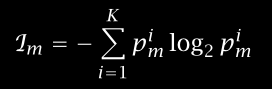

- Steps for prediction
	- Compute the distance between the new point and every other point in data
	- The argmax(distance(new point, data point))
		- Find the class of K closest points to the new data point
		- The majority of the class of these K points will be the predicted class of the new data point
- To determine K, start with K = 1 and increment K by 2, out of these values of K use the K value with least error
- To improve the KNN algo
	- Always normalize the data
	- Use distance weighted voting to determine the class 

### 2. Decision Trees
- Non parametric, transductive, discriminative model 
	- In non parametric model, split the input space into local regions
- Decision tree
	- Internal nodes: contains one or more attribute with which we split the input space
	- At each internal node, we can split the space into two or more local regions
	- The leaf nodes belong to an output label, this label will be the output
- Types
	- Univariate
		- At each level split based on one attribute
		- When using a univariate split, the decision boundary is axis aligned. i.e. the decision boundary equation will look sime thing like x = c 
	- Multivariate
		- At each level split based on multiple attributes 
		- When using a multivariate split, the decision boundary will not be axis aligned. Example: if the decision is made by x1 + x2 < split_value. In this case x1 + x2 = split_value will be a line that is not parallel to axis
- How to choose the the split? Information Gain
	- A split is good, 
	- Why do we prefer splits that has highest information gain?
		- Information gain = Impurity of parent node - weighted average of impurity of the child nodes
			- What is the weight of a child node?
				- weight of child node = (Nchild</child>)/(Nparent)
				- Where
				- Nchild</child> = number of data points reaching the child node
				- Nparent = number of data points reaching the parent node
		- This is a a greedy method where we choose the split with highest information
		- This might not create the decision tree with the shortest node, because we choose the best split for a particular depth
- How to calculate impurity?
	- Entropy
		- Let there be k classes, and N data points reach a particular node
		- The entropy is given by the following: 
		- Where m is the node, i is the class and p is the probability P(Class i | x, m) which is calculated by counting frequency Ni/N 
			- Ni is the number of instances that belong to class i
			- N is the total number of instances that reach node m
		- To check if a split is better, calculate the impurity for each node after split and sum them
	- Gini Index
		- Impurity = sum of p(i)* (1-p(i)) for all classes
		- When all data points belong to a class, the impurity will be 0
- Improvement Strategies
	- Pruning tree:
		- Instead of splitting each node until its completely pure, stop when it pure enough
		- This will be mentioned as threshold