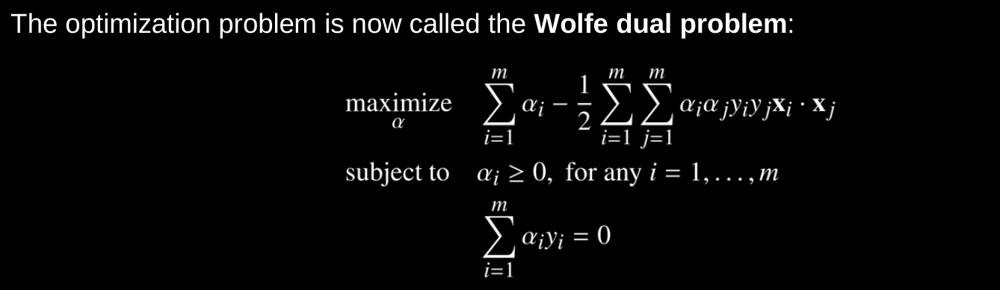
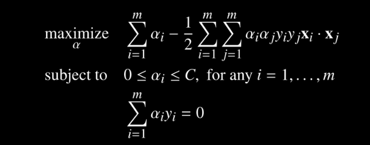
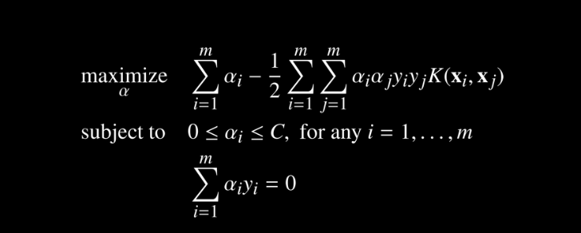
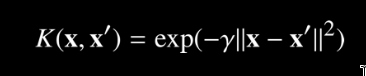

### 1. What are Support vector Machines?
- SVM is a linear model used for binary classification
	- A single SVM cannot be used for multi-class classification
	- If there are N classes, we will train N SVM, 1 for each class
- SVM has the following properties
	- Inductive model
		- Uses linear decision boundaries
	- Parametric model
		- The basic SVM is a parametric model
		- The SVM with kernels will be a non parametric model
	- Discriminative model
- How is SVM different from Logistic regression if both use a linear decision boundary?
	- SVM tries to find the decision boundary such that, the distance between the boundary and data points is maximum while still correctly classifying the data points
	- In short, SVM tries to find the maximum margin decision boundary
	- Why use the maximum margin to find the decision boundary? This is to generalize.  
- Can there be any data points between the margin?
	- For a Hand margin SVM: there should be no points between the margin
	- For a soft margin SVM: there can be points between the margin

### 2. Defining the SVM (hard margin SVM)
#### 2.1. What is the decision boundary equation?
- wx + b = 0
- Where w is the parameters that is learnt. This w vector is perpendicular to the decision boundary
- What are we trying to find?
	- First find the equation of the margins
	- Then find the distance between the margins. This distance should be maximum while still classifying the data points correctly
- We will use these margins to classify a point
#### 2.2. What will the equation of this margin be?
- We will have two margin lines, one is the +ve margin and the other is the -ve margin.
- Each of these margin lines are equidistant from the decision boundary
- For each positive sample xi that lies exactly on the +ve margin
	- wxi + b = 1 --> **Equation 1**
	- Here +ve margin is the line beyond which we classify as +ve
		- wxi + b >= 1, then the data point belongs to +ve class
- For each negative sample xi that lies exactly on the -ve margin
	- wxi + b = -1 --> **Equation 2**
	- Here -ve margin is the line beyond which we classify as -ve 
		-  wxi + b >= -1, then the data point belongs to -ve class
- This can be simplified into one equation by introducing a variable yi, where 
	- yi is +1 for positive samples and -1 for negative samples. Multiply this wit 
- The equation of the margins is
	- yi \* w \* xi + b = 1
#### 2.3. What is the distance between the margins?
- The distance between these two margin lines should be maximized for a SVM
- Now that we know the equation of the margin, we will need to find the distance between the two margins
- Take two points, x+ve one on the +ve margin and x-ve one on the negative margin
	- To get the distance between the margins, we need to project the  x+ve - x-ve on a unit line that is perpendicular to the margins
	- We already know that w is perpendicular to the margins
	- x+ve \* w/||w|| = (1 - b)/||w|| from equation 1
	- x-ve * w/||w|| = (-1 - b)/||w|| from equation 2
		- Here ||w|| is the magnitude of w 
	- Taking the difference, the width of the margin is
		- Width of margin = ((1 - b) - (-1 -b))/||w|| = 2/||w||
		- We need to maximize this margin
#### 2.4. Maximising the distance between the margin
- Width of the margin = 2/||w||
- The optimization problem
	- minimize ||w||2/2 , wrt w,b
	- Subject to the constraint yi \* w \* xi + b - 1 >= 0 
		- This constraint is to ensure that the data points are classified correctly
##### 2.4.1. Lagrangian multipliers
- To find the minima/maxima of a function subject to constrains, we use Lagrange multipliers
	- To find the maxima, we add the Lagrangian multipliers  
	- To find the minima, we subtract the Lagrangian multipliers 
- Here each constraint is in the form g(x) >= 0
##### 2.4.2. Optimization represented as Lagrangian 
- L = ||w||2/2 - summation of all constraints * Lagrange multiplier for that constraint
- L(w, b, α) = ||w||2/2 - Σ α i \* \[yi \* w \* xi + b - 1\] --> Equation 3
	- Here we will have a constraint for each data point. Each data point needs to be classified correctly
	- We need to minimize this expression to maximize the distance between boundaries 
- Observation: 
	- The L(w,b,α), can take a maximum value of ||w||2/2
		- This is because ||w||2/2 is subtracted from a non-negative term
	- This implies the max(L(w,b,α)) wrt α will be less than or equal to ||w||2/2 --> lets call this the objective function 
##### 2.4.3. The SVM optimization
- From the previous observation, we can conclude that minimizing the objective function is same as minimizing the (max of L(w, b, α) wrt α)
- This is called the primal from, we will convert this to the dual form.
- Primal: minw,b(maxα(L(w,b,α)))
- Dual form: maxα(minw,b(L(w,b,α)))
	- Both primal and dual solution will be the same if(Slater's condition)
		- The objective function is convex and the constraints are affine 
		- To check if a function is convex, find the hessian of the function. This hessian matrix should be positive semi definite
	- The Lagrangian multipliers can be used only for equality constraints. But we can use it for inequality constraints based on the KKT conditions
		- Each Lagrangian multiplier should be non negative
		- α \. y = 0, where α and y are vectors of size of the dataset, and . represent the dot product
##### 2.4.4. Removing the constrain on w and b
- We need to minimize L wrt to w,b and maximize wrt alpha(Lagrangian multipliers) using the dual form
- Differentiate L wrt w and equate it to 0 to find the extremum
	- This will give w = Σ α i \* \yi \* xi  
- Differentiate L wrt b and equate it to 0 to find the extremum
	- This will give Σ α i \* \yi = 0
- Substituting w in equation 3
	- L =  Σ α i - 0.5 * ΣΣ α i \* \yi \* α j \* \yj \* xi \* xj --> Equation 4
	- **NOTE: The optimization depends only on the pairwise dot product of the data points**
	- We obtained equation 4 by minimizing the Lagrangian wrt to w and b. To obtain the Lagrange multipliers, the equation 4 is maximized wrt to the multipliers
	- We are using the dual form of the optimization problem
##### 2.4.5. Using the SVM on non linearly separable data 
- When the data is not linearly separable, we project the data to a higher dimension and then check if it is linearly separable
	- We don't need to project the data to higher dimension and then find the dot product that is required in equation 4. 
	- This can be done directly using kernel function that take two vectors as input and return the dot product of those vectors in higher dimension
- How does the optimization problem change? 
	- Instead of the pairwise dot product, we will use the kernel
	- This was the advantage to converting the optimization problem to the dual form
#### 2.7. Finding W
- Find the Lagrangian multipliers such that the following equations is maximized 
- This equation can be solved using quadratic programming solvers

### 3. Soft margin SVM
- For each data point the constraint has a new slack variable ζ
- Our new constrain will look as follows
	- yi \* w \* xi + b >= 1 - ζi 
- Our new optimization function will also minimize the sum of all slack variables
	- Minimize ||w||2/2 + C \* summation of all slack variables
	- Note that the slack variable is a positive constant
	- We use the slack variables in the optimization to minimize the error. If we do not include this, the slack variable can have large values, the margin will be bigger but at the cost of misclassification
	- Here C (+ve constant) is the constant that determines how much the slack variables can change
		- When C +inf, we will have a hard margin SVM
		- When C is small, we will have a soft margin SVM
- Optimization function in soft margin SVM
	- The optimization problem is same, but with different constraints

### 4. Kernel SVM
#### 4.1 What are kernel functions?
- Intuition
	- Data that is not linearly separable in the current dimension can be linearly separable in a higher dimension
- Since we need only the pairwise dot product of all the data points, we do not need to actually convert the points to higher dimension
- If we have a f(x1, x2), that gives the dot product of x1,x2 in the higher dimension in terms of x1,x2 
	- These types of functions are called kernel functions
	- The kernel also represents the similarity of two vectors, choosing a kernel requires domain knowledge and knowledge about how kernels work. A large output of a kernel function mean the inputs are similar 
	- A valid kernel function K(x1, x2) can be mapped to the higher dimension dot product of x1 and x2 for all values of x1 and x2. $$K(\vec{x_1}, \vec{x_2}) = \phi(\vec{x1})\cdot\phi(\vec{x2}) $$ 
#### 4.2 Check if a function is a valid kernel function: Mercer's Theorem
- Condition 1: The function f(.) is symmetric
	- f(x, y) = f(y, x)
- The kernel matrix should be a positive semi-definite matrix for any number of points
	- Gram matrix/Kernel matrix: 
		- Apply the kernel function on all the data points X
		- The matrix containing all these results is called the kernel/gram matrix 
#### 4.3 Dual problem using kernel and soft margin
- The following image represents the dual problem for a kernel svm with soft margin 
- Here K(xi, xj) is the kernel function
#### 4.4 Types of kernels
- Linear kernels 
	- K(xi, xj) = xi.xj
- Polynomial Kernel
	- K(xi, xj) = (xi.xj + x)d
- Gaussian kernel/Radial Basis function
	- 
	- Here the gamma is the weight parameter
		- If gamma is too small: we get a linear kernel
		- Increasing the gamma value increases the influence of the support vectors  
#### 4.3. Mercer's condition
- A function can be used as a kernel only if the function is positive semi definite

### 5. Math
#### 5.1 Positive semi-definite matrix 
- A matrix H is positive semi-definite, if the following conditions are true (checking one condition is sufficient)
	- xTHx >=0 for all non-zero vectors x
	- Check if all the eigen values are non negative 
	- Check if all leading determinants are non negative
		- What are leading determinants?
			- If the matrix is NxN, the leading determinants are the det|1x1|, det|2x2| ... where we consider these matrix from the top left corner
- Application: 
	- If a function is twice differentiable, then partial derivative of f = 0 will give the minima if the hessian matrix of f is positive semi-definite
	- A function is a valid kernel, if the kernel matrix K is positive semi-definite